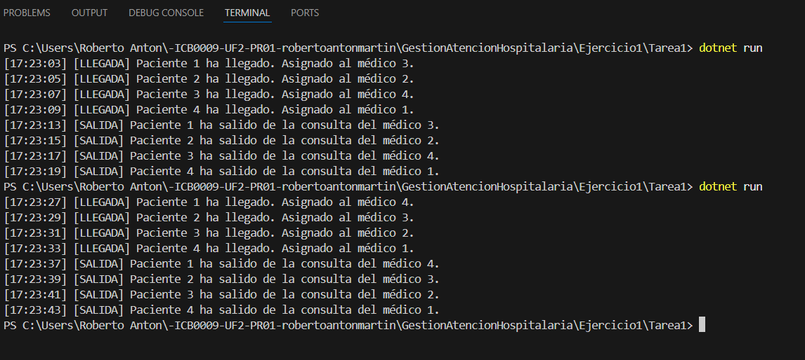

# Tarea 1 – Simulación básica de atención médica

## Descripción

Este programa simula la llegada de **4 pacientes** a un hospital donde hay **4 médicos disponibles**.  
Cada paciente llega cada **2 segundos** y se le asigna aleatoriamente uno de los médicos, siempre y cuando esté libre.  
Un médico solo puede atender a un paciente a la vez.  
La atención médica dura exactamente **10 segundos** por paciente.

El programa está diseñado para respetar la concurrencia, asegurando que:
- No haya dos pacientes atendidos por el mismo médico al mismo tiempo.
- La llegada y salida de pacientes se visualiza por consola con marcas de tiempo.

---

## Tecnologías utilizadas

- Lenguaje: C#
- Plataforma: .NET Console App
- Concurrencia: `Thread`, `SemaphoreSlim`, `lock`

---

## Respuestas a las preguntas de la práctica

### ¿Cuántos hilos se están ejecutando en este programa?

Se están ejecutando **4 hilos**, uno por cada paciente.  
Cada paciente es gestionado por un hilo independiente que se encarga de esperar la llegada, solicitar un médico libre y simular la atención durante 10 segundos.  
Además, el hilo principal (`Main`) se encarga de lanzar estos hilos cada 2 segundos.

---

### ¿Cuál de los pacientes entra primero en consulta?

El paciente **1**, ya que es el primero en ser lanzado por el hilo principal después de 2 segundos de espera inicial.

---

### ¿Cuál de los pacientes sale primero de consulta?

Depende de:
- Qué médico fue asignado (aleatorio).
- Cuándo estuvo libre ese médico.

Aunque el paciente 1 entra antes, si se le asigna un médico ocupado y el paciente 2 consigue un médico libre rápidamente, **puede salir antes**.  
Este comportamiento refleja la concurrencia real del sistema.

---

## Captura de pantalla

A continuación se muestra la ejecución del programa:

