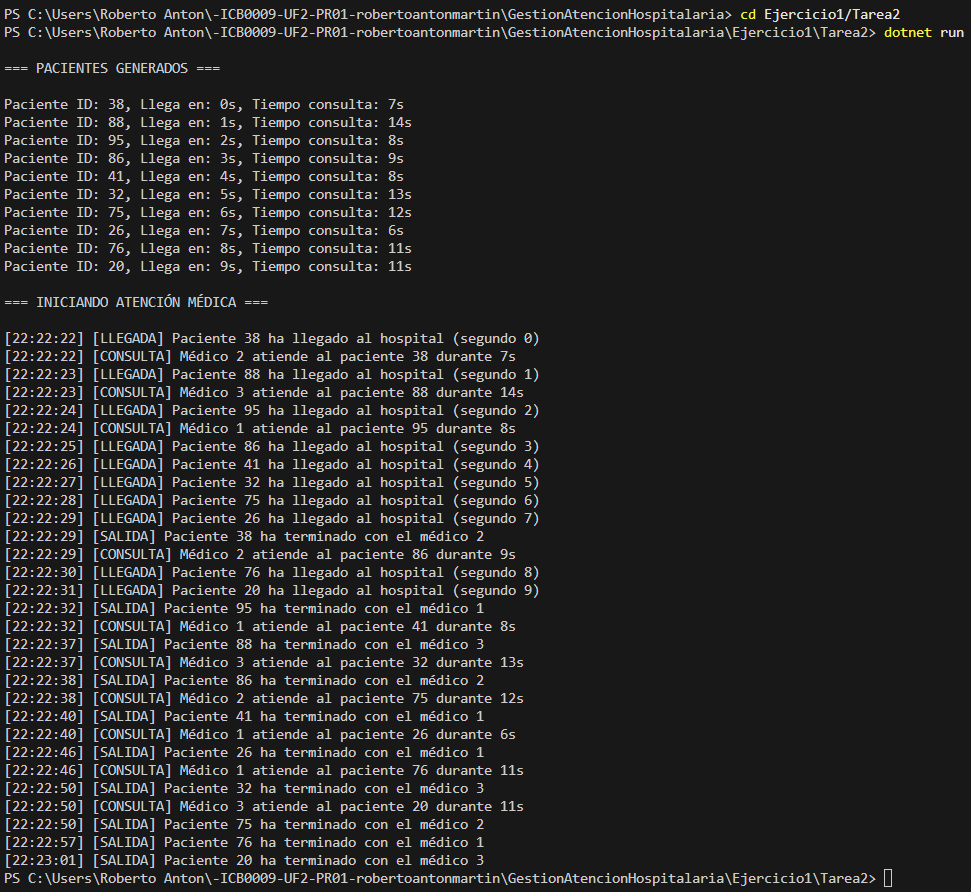

# Tarea 2 – Simulación de atención médica con llegada aleatoria

## Descripción

Este programa simula la llegada de **10 pacientes** a un hospital donde hay **3 médicos disponibles**.  
Cada paciente tiene un **tiempo de llegada** simulado entre los segundos 0 y 9, y un **tiempo de consulta aleatorio** entre 5 y 15 segundos.  
Cada médico solo puede atender a **un paciente a la vez**.  
Si todos los médicos están ocupados cuando llega un paciente, este espera a que se libere alguno.

El programa está diseñado para respetar la concurrencia, asegurando que:
- Cada paciente es atendido individualmente por un único médico.
- La llegada y la atención se controlan mediante `Thread.Sleep()`.
- Se utilizan semáforos (`SemaphoreSlim`) para controlar el acceso a los médicos.
- La aleatoriedad y la integridad de datos se protegen mediante `lock`.

---

## Tecnologías utilizadas

- Lenguaje: C#
- Plataforma: .NET Console App
- Concurrencia: `Thread`, `SemaphoreSlim`, `lock`, `Random`

---

## Respuestas a las preguntas de la práctica

### ¿Cuántos hilos se están ejecutando en este programa?

Se están ejecutando **10 hilos**, uno por cada paciente.  
Cada paciente es gestionado por un hilo independiente que espera su tiempo de llegada, solicita un médico disponible y simula el tiempo de consulta.  
Además, el hilo principal (`Main`) se encarga de crear los pacientes, inicializar los semáforos y lanzar los hilos concurrentes.

---

### ¿Cuál de los pacientes entra primero en consulta?

En general, el paciente que **entra primero en consulta** será aquel que **llega antes al hospital** y encuentra un médico disponible justo al llegar.

En este programa, cada paciente se lanza en su propio hilo y espera su tiempo de llegada (`LlegadaHospital`).  
Una vez llega, intenta acceder a un médico libre.  
Si lo consigue de inmediato, entra en consulta; si no, espera hasta que uno esté disponible.

Por lo tanto, lo más habitual es que el **paciente con `LlegadaHospital = 0`** sea el primero en entrar,  
aunque **si varios llegan muy cerca en el tiempo**, la asignación también dependerá de cómo el sistema planifique los hilos y qué médico esté libre en ese momento.

---

### ¿Cuál de los pacientes sale primero de consulta?

Depende de:
- El tiempo de llegada (`LlegadaHospital`)
- El tiempo de consulta (`TiempoConsulta`)
- La disponibilidad del médico asignado

Por ejemplo, si un paciente que llega más tarde tiene un tiempo de consulta muy corto y un médico libre justo al llegar, **puede salir antes que otros pacientes que llegaron antes pero tienen tiempos de consulta más largos** o esperaron por médico.

Este comportamiento refleja una gestión concurrente realista de los recursos.

---

## Captura de pantalla

A continuación se muestra la ejecución del programa:

