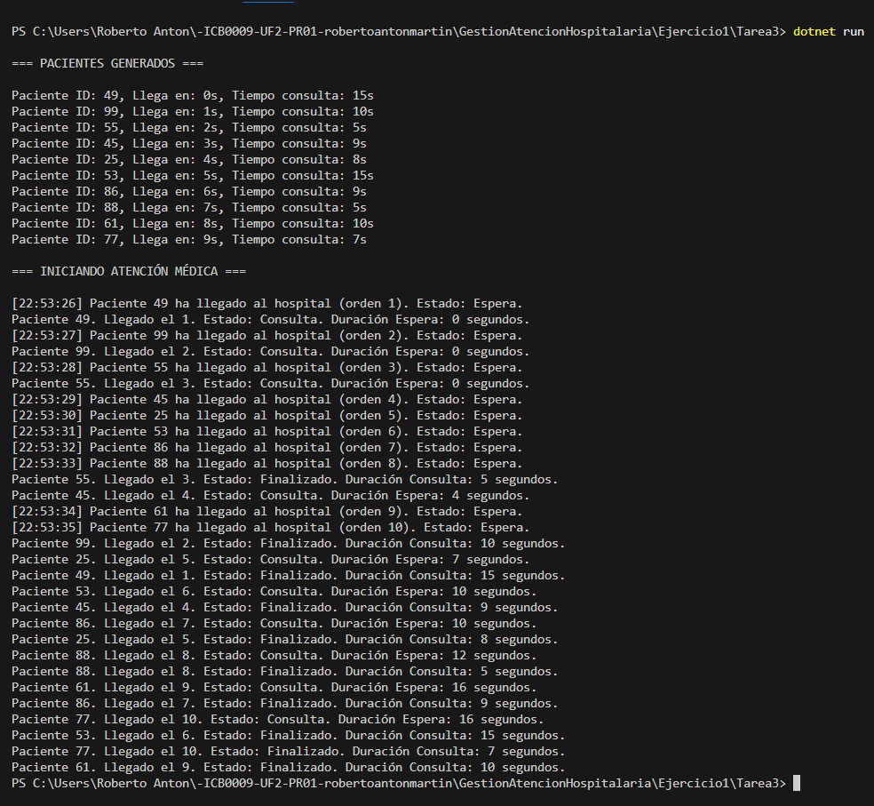

# Tarea 3 – Visualización del avance de los pacientes

## Descripción

Este programa amplía la simulación del hospital con **10 pacientes** y **3 médicos**, mostrando por consola los **cambios de estado de cada paciente** a lo largo del proceso de atención médica.  
Cada paciente tiene un **tiempo de llegada** simulado entre los segundos 0 y 9, y un **tiempo de consulta aleatorio** entre 5 y 15 segundos.

A medida que los pacientes llegan al hospital, se **encolan**. Los médicos, gestionados por hilos independientes, van **atendiendo pacientes disponibles en la cola**, uno a uno.  
En cada cambio de estado (espera → consulta → finalizado), se muestra:

- ID del paciente  
- Orden de llegada  
- Estado actual  
- Duración del estado anterior en segundos

El programa está diseñado para respetar la concurrencia, asegurando que:
- Cada paciente es atendido individualmente por un único médico.
- Se visualiza claramente cuándo entra y cuándo sale de consulta.
- La sincronización de los mensajes está protegida para evitar colisiones.
- Los cálculos de tiempo se hacen con `DateTime` y se presentan con precisión.

---

## Tecnologías utilizadas

- Lenguaje: C#
- Plataforma: .NET Console App
- Concurrencia: `Thread`, `Queue`, `lock`, `DateTime`, `TimeSpan`, `Random`

---

## Respuestas a las preguntas de la práctica

### ¿Cuántos hilos se están ejecutando en este programa?

Se ejecutan **13 hilos** en total:

- **10 hilos**, uno por cada paciente, que simulan su llegada al hospital en tiempos distintos.
- **3 hilos**, uno por cada médico, que atienden pacientes desde una cola compartida.

Cada hilo médico permanece activo hasta que se ha atendido a todos los pacientes.  
El hilo principal (`Main`) lanza todos los hilos y no participa directamente en la atención.

---

### ¿Qué información se muestra por consola?

Cada vez que un paciente cambia de estado, se imprime un mensaje indicando:

- Su ID y orden de llegada  
- El estado al que pasa (`Consulta` o `Finalizado`)  
- El **tiempo que ha durado el estado anterior**, en segundos

---

### ¿Cuál de los pacientes entra primero en consulta?

En general, será el paciente con `LlegadaHospital = 0`,  
pero en la práctica depende de:
- Qué médico está disponible primero
- Si varios pacientes llegan al mismo tiempo
- Orden en que los hilos acceden a la cola

---

### ¿Cuál de los pacientes sale primero de consulta?

Depende de:
- Su orden de llegada
- El médico que lo atiende
- Su duración de consulta

Un paciente que llega más tarde pero tiene un tiempo de consulta corto **puede salir antes** que otros que llegaron antes pero tuvieron tiempos de consulta largos.

---

## Captura de pantalla

A continuación se muestra la ejecución del programa:

