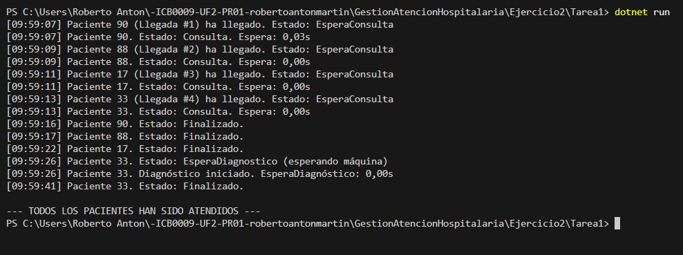

# Tarea 1 – Unidades de diagnóstico

## Descripción

Esta tarea amplía la simulación hospitalaria incorporando **máquinas de diagnóstico**.

Cada uno de los **4 pacientes** es atendido inicialmente por uno de los **4 médicos disponibles**. Al finalizar su consulta, algunos pacientes pueden requerir una **prueba diagnóstica adicional**, simulada mediante el uso de **2 máquinas compartidas** que solo pueden atender a un paciente a la vez.

### Proceso de atención:
1. El paciente llega al hospital (cada 2 segundos).
2. Espera un médico libre para entrar en consulta (con `SemaphoreSlim`).
3. Tras la consulta (de 5 a 15 segundos), si necesita diagnóstico:
   - Pasa al estado `EsperaDiagnostico`.
   - Espera a una máquina libre (con `SemaphoreSlim`).
   - Realiza la prueba diagnóstica (15 segundos).
4. Finaliza su atención y se muestra toda la información por consola.

Todos los cambios de estado son sincronizados con `lock` para evitar colisiones entre hilos.

---

## Tecnologías utilizadas

- Lenguaje: **C#**
- Plataforma: **.NET Console App**
- Concurrencia:
  - `Thread` para representar pacientes
  - `SemaphoreSlim` para limitar médicos y máquinas
  - `lock` para sincronización
  - `DateTime` y `TimeSpan` para medir tiempos
  - `Random` para asignar datos aleatorios

---

## Respuestas a la pregunta de la práctica

### ¿Los pacientes que deben esperar para hacerse las pruebas diagnóstico entran luego a hacerse las pruebas por orden de llegada?

En esta tarea, **sí** acceden a las máquinas de diagnóstico en función de su orden de finalización de consulta, que suele coincidir con el orden de llegada si los tiempos de consulta son similares.

Se ha comprobado este comportamiento ejecutando varias veces el programa y analizando las trazas de consola, donde se observa:
- El cambio a estado `EsperaDiagnostico` tras la consulta.
- La entrada a `Diagnóstico iniciado` cuando una máquina está libre.
- Tiempos de espera antes de entrar a la máquina.

Como solo había **1 paciente que necesitó diagnóstico** en la ejecución mostrada, **no se generó cola**. Sin embargo, la implementación con `SemaphoreSlim(2)` asegura que si más pacientes lo necesitaran, entrarían **uno a uno**, sin colisiones, según el orden de llegada al estado `EsperaDiagnostico`.

---

## Captura de pantalla

A continuación se muestra la ejecución del programa:

