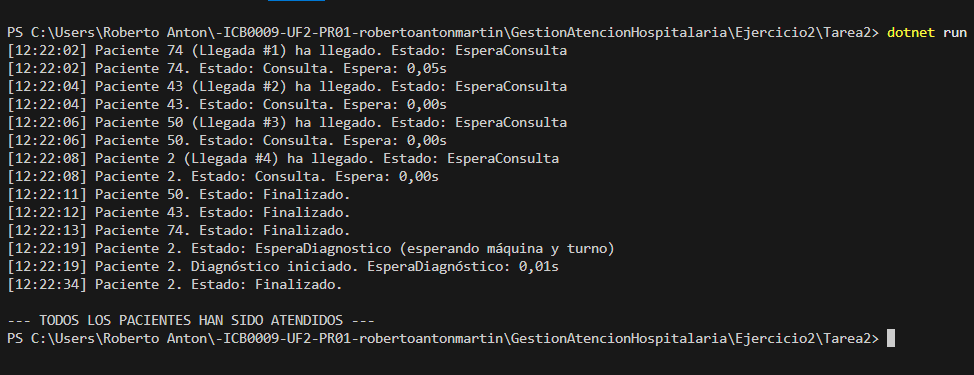

# Tarea 2 – Unidades de diagnóstico con acceso ordenado

## Descripción

Esta tarea ajusta la simulación hospitalaria incorporando un **mecanismo de acceso justo a las máquinas de diagnóstico**, basado en el **orden de llegada al hospital**, no en el orden de salida de la consulta.

Cada uno de los **4 pacientes** es atendido inicialmente por uno de los **4 médicos disponibles**. Al finalizar su consulta, algunos pacientes pueden requerir una **prueba diagnóstica adicional**, utilizando una de las **2 máquinas compartidas**. La novedad principal de esta tarea es que el orden para entrar en diagnóstico se **sincroniza estrictamente según la llegada al hospital**, lo que garantiza equidad y evita saltos de turno.

### Proceso de atención:
1. El paciente llega al hospital (cada 2 segundos).
2. Espera un médico libre para entrar en consulta (`SemaphoreSlim`).
3. Tras la consulta (de 5 a 15 segundos), si necesita diagnóstico:
   - Se añade a una cola compartida (`List` protegida con `lock`).
   - Espera su turno, que se calcula como el paciente con menor `OrdenLlegada`.
   - Espera a una máquina libre (`SemaphoreSlim`).
   - Realiza la prueba diagnóstica (15 segundos).
4. Finaliza su atención y se informa por consola en cada transición de estado.

Todos los accesos a estructuras compartidas están correctamente sincronizados para evitar condiciones de carrera.

---

## Tecnologías utilizadas

- Lenguaje: **C#**
- Plataforma: **.NET Console App**
- Concurrencia:
  - `Thread` para simular pacientes
  - `SemaphoreSlim` para limitar médicos y máquinas
  - `lock` para sincronización de acceso a consola y listas compartidas
  - `DateTime` y `TimeSpan` para medir tiempos
  - `Random` para definir tiempos y diagnósticos de forma aleatoria
  - `List` + `Min()` para determinar el siguiente paciente en diagnóstico

---

## Respuestas a la pregunta de la práctica

### ¿Los pacientes que deben esperar para hacerse las pruebas diagnóstico entran luego a hacerse las pruebas por orden de llegada?

Sí, y de forma **estricta y garantizada**. A diferencia de la Tarea 1 (donde el primero en terminar consulta podía entrar antes), esta implementación **fuerza el orden de llegada** como prioridad.

Se ha validado este comportamiento en múltiples pruebas consecutivas, donde:
- Pacientes que terminaron la consulta antes **esperaron** si no eran los primeros en llegar al hospital.
- Pacientes con menor `OrdenLlegada` accedieron primero a las máquinas de diagnóstico.
- Los cambios de estado se reflejaron por consola correctamente y en orden.

El acceso se gestiona con una lista protegida y un control de turno manual usando `Min(OrdenLlegada)`, cumpliendo con lo enseñado en clase sin estructuras avanzadas.

---

## Parte 2: Otra posibilidad de solución

Una alternativa viable  sería usar una **cola de prioridad** o una estructura como `SortedDictionary`, que reordenase automáticamente los pacientes al insertarlos. Sin embargo, he optado por una solución basada únicamente en `List`, `lock` y búsquedas manuales con `Min()`.

---

## Captura de pantalla

A continuación se muestra una ejecución del programa con varios pacientes diagnosticados en orden:

