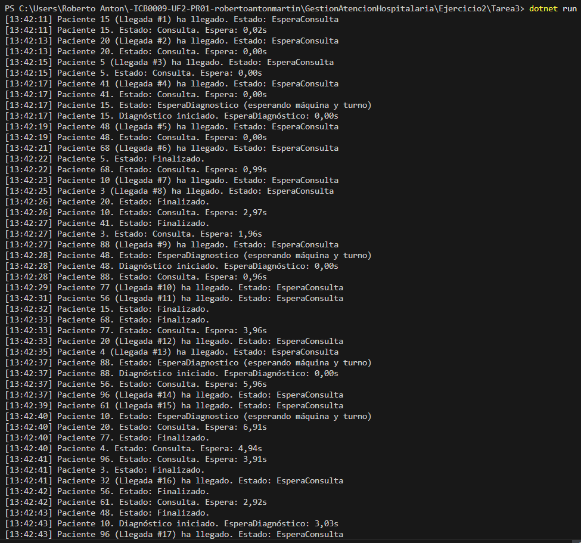
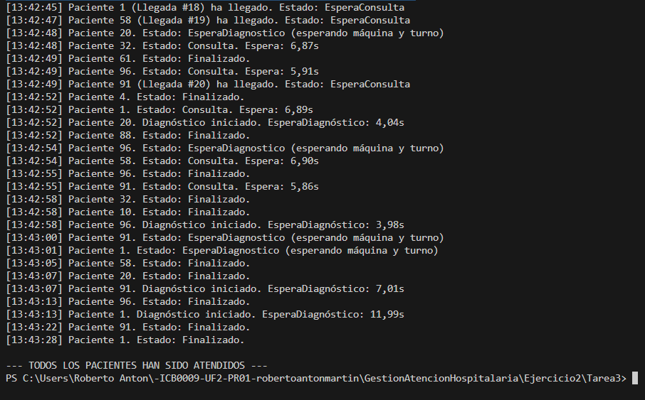

# Tarea 3 – Más pacientes con acceso ordenado a diagnóstico

## Descripción

Esta tarea representa la ampliación del flujo de atención hospitalaria a **20 pacientes**, manteniendo los **4 médicos** y las **2 máquinas de diagnóstico** del hospital.

Cada paciente llega de forma secuencial, **uno cada 2 segundos**, y puede requerir una prueba diagnóstica adicional tras su consulta. La principal mejora respecto a tareas anteriores es el uso de una **cola (`Queue`)** para asegurar que el **orden de acceso a diagnóstico se respeta estrictamente según la llegada al hospital**.

### Proceso de atención:
1. El paciente llega al hospital con un tiempo determinado.
2. Espera un médico disponible (`SemaphoreSlim`) para entrar en consulta.
3. Una vez finalizada la consulta, si requiere diagnóstico:
   - Se encola en una `Queue<Paciente>`, protegida con `lock`.
   - Espera su turno en función del orden de llegada (FIFO).
   - Espera una máquina libre (`SemaphoreSlim`).
   - Realiza la prueba diagnóstica (15 segundos).
4. Finaliza el proceso y se muestra su estado por consola.

---

## Tecnologías utilizadas

- Lenguaje: **C#**
- Plataforma: **.NET Console App**
- Concurrencia:
  - `Thread` para representar pacientes
  - `SemaphoreSlim` para limitar médicos y máquinas
  - `lock` para sincronización de consola y estructuras compartidas
  - `Queue<Paciente>` para modelar una cola FIFO
  - `DateTime`, `TimeSpan` para medir tiempos
  - `Random` para asignar tiempos aleatorios de consulta y diagnóstico
  - **Métodos delegados** para pasar parámetros a los hilos

---

## Respuestas a las preguntas de la práctica

### ¿Qué planteamiento has seguido y por qué?

He optado por **usar `Queue<Paciente>` en lugar de `List`** para gestionar el acceso a diagnóstico, ya que es una estructura específicamente diseñada para garantizar **el orden de llegada (FIFO)**.  
Esto mejora la eficiencia del código y se alinea perfectamente con el temario impartido en clase, donde se ha trabajado el uso de colas.

Además, todos los elementos de sincronización (`lock`, `SemaphoreSlim`, `Thread`, `Start`, `Join`, `Random`) han sido implementados conforme al contenido visto.

### ¿Los pacientes entran a la consulta por orden de llegada?

Sí, pero **solo si hay médicos disponibles**. En caso contrario, el paciente se mantiene en estado `EsperaConsulta` hasta que se libera un médico.

He validado el comportamiento realizando múltiples ejecuciones y analizando el log por consola. He comprobado que:
- Se respetan los tiempos de espera.
- No hay colisiones de acceso a médicos ni máquinas.
- El orden de llegada se respeta rigurosamente en la entrada a diagnóstico.
- La cola `Queue` actúa correctamente como buffer FIFO.

---

## Capturas de pantalla

A continuación, se muestran dos ejecuciones del programa en distintos escenarios:

- 
- 
