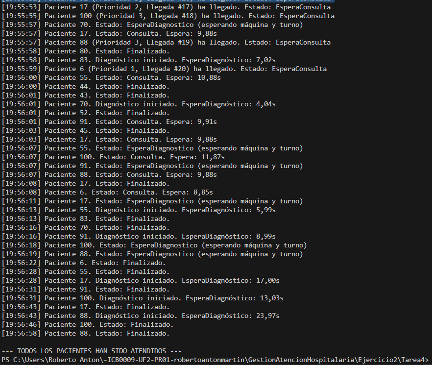

# Tarea 4 – Prioridades de los pacientes

## Descripción

Esta tarea amplía la lógica de atención hospitalaria simulando un sistema realista de **priorización clínica**, en el que los pacientes no se atienden solo por orden de llegada, sino también por **nivel de gravedad**.

Cada paciente es clasificado aleatoriamente en una de estas **tres prioridades** al llegar al hospital:

- **Nivel 1:** Emergencias → atendidos primero.
- **Nivel 2:** Urgencias → atendidos después de las emergencias.
- **Nivel 3:** Consultas generales → atendidos al final.

Este sistema afecta tanto al acceso a los **médicos** como a las **máquinas de diagnóstico**.

### Proceso de atención:
1. El paciente llega al hospital (cada 2 segundos), se le asigna una prioridad y entra en la cola.
2. Espera un médico libre (`SemaphoreSlim`), que atiende a quien tenga **mayor prioridad** y, en caso de empate, al que haya llegado antes.
3. Realiza una consulta médica (entre 5 y 15 segundos).
4. Si requiere diagnóstico:
   - Se añade a una cola compartida (`List` protegida con `lock`).
   - Espera su turno, que se calcula según menor `Prioridad` y luego por `OrdenLlegada`.
   - Espera a una máquina libre (`SemaphoreSlim`).
   - Realiza la prueba diagnóstica (15 segundos).
5. Finaliza su atención y todos los estados se muestran por consola.

Todos los accesos a recursos compartidos están correctamente sincronizados mediante `lock`, evitando condiciones de carrera y garantizando la equidad.

---

## Tecnologías utilizadas

- Lenguaje: **C#**
- Plataforma: **.NET Console App**
- Concurrencia:
  - `Thread` para simular pacientes
  - `SemaphoreSlim` para limitar el acceso a médicos y máquinas
  - `lock` para evitar conflictos en consola y colas compartidas
- Control de prioridad:
  - `List` + `Min()` para encontrar el siguiente paciente por prioridad y llegada
- Medición de tiempos:
  - `DateTime` y `TimeSpan` para calcular tiempos de espera reales
- Aleatoriedad:
  - `Random` para definir prioridad, tiempo de consulta y si se requiere diagnóstico

---

## Respuestas a la pregunta de la práctica

### ¿Los pacientes se atienden en función de su prioridad?

Sí. Esta implementación **garantiza un acceso justo y coherente** en base al nivel de prioridad médica:

- **Emergencias (nivel 1)** tienen prioridad absoluta.
- **Urgencias (nivel 2)** esperan a que no haya emergencias pendientes.
- **Consultas generales (nivel 3)** son atendidas si no hay pacientes de prioridad superior.

Cuando hay empate de prioridad, se sigue el **orden de llegada al hospital** (`OrdenLlegada`).

Este mecanismo se aplica tanto a la atención médica como a las pruebas diagnósticas. Se ha validado en múltiples ejecuciones del programa que los pacientes entran y son atendidos de forma totalmente consistente, sin colisiones entre hilos ni duplicaciones de atención.

---

## Parte 2: Otra posibilidad de solución

Una posible alternativa sería utilizar una **cola de prioridad** (`PriorityQueue`) que ordene automáticamente a los pacientes al insertarlos. Sin embargo, he tenido **dificultades para implementarlo**.

Por eso, he optado por una solución **Que para mí resulta más sencilla**, utilizando:

- `List` compartida
- Control manual con `Min()` sobre prioridad y orden
- Sin estructuras no vistas, asegurando comprensión y cumplimiento académico

---

## Captura de pantalla

A continuación se muestra la ejecución del programa donde se comprueba que:

- **Emergencias** son atendidas primero,
- seguidas por **urgencias**
- y finalmente las **consultas generales**.

  

