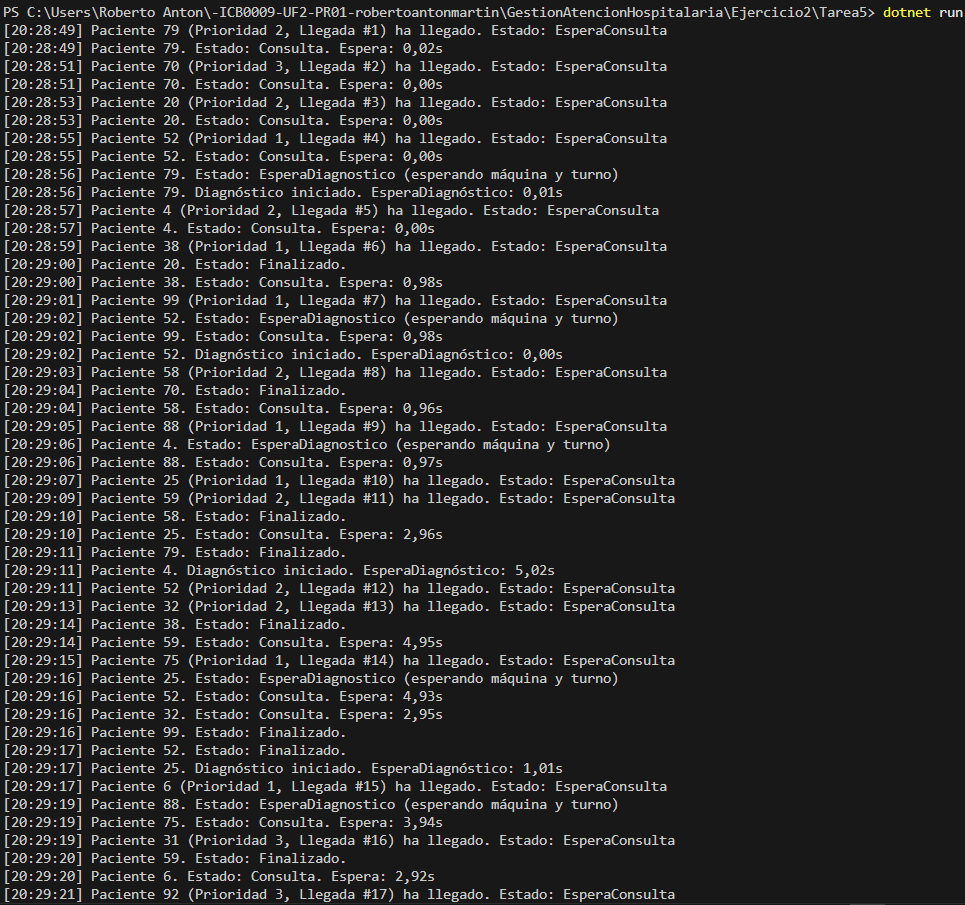
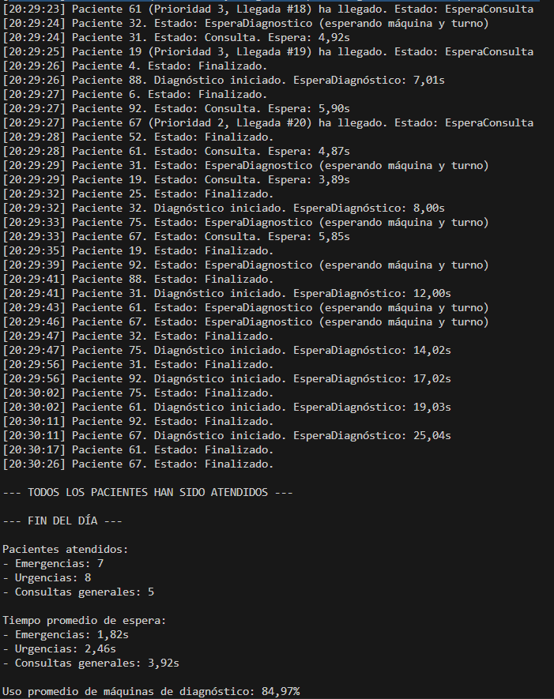

# Tarea 5 – Estadísticas y logs

## Descripción

Esta tarea cierra la simulación hospitalaria incorporando la **generación de estadísticas** al final del programa. Se analiza el comportamiento de los pacientes y los recursos hospitalarios una vez han sido atendidos todos.

El objetivo es obtener una **visión completa del día**: cuántos pacientes se han atendido según su prioridad, cuánto han esperado de media y cuánto se ha utilizado el sistema de diagnóstico.

### Métricas obtenidas:
1. **Número total de pacientes atendidos**, agrupados por tipo de prioridad:
   - Emergencias (Prioridad 1)
   - Urgencias (Prioridad 2)
   - Consultas generales (Prioridad 3)

2. **Tiempo medio de espera** para entrar en consulta (desde que llegaron al hospital).

3. **Porcentaje de uso de las máquinas de diagnóstico**, calculado en base al tiempo total activo frente al tiempo disponible.

---

## Tecnologías utilizadas

- Lenguaje: **C#**
- Plataforma: **.NET Console App**
- Concurrencia:
  - `Thread` para simular pacientes concurrentes
  - `SemaphoreSlim` para gestionar el número de médicos y máquinas de diagnóstico
  - `lock` para proteger estructuras compartidas (`List`, consola)
- Sincronización:
  - Cola de diagnóstico priorizada con `List`, `OrderBy()` y `ThenBy()`
- Medición de tiempos:
  - `DateTime` para calcular tiempos de espera y uso real de recursos
  - `TimeSpan` para hacer las operaciones entre fechas
- Estadísticas:
  - `Average()` para calcular medias
  - `Sum()` para tiempo total de uso
  - Porcentaje de uso sobre las 2 máquinas disponibles

---

## Respuestas a la pregunta de la práctica

### ¿Puedes explicar tu código y por qué has decidido hacerlo así?

Sí. He diseñado el código manteniendo **toda la lógica de concurrencia que ya tenía implementada** en tareas anteriores, y he añadido al final del programa una función llamada `MostrarEstadisticas()` que:

- Agrupa los pacientes por prioridad.
- Calcula el tiempo medio de espera desde que llegan hasta que acceden a un médico.
- Suma el tiempo total que cada paciente ha estado en diagnóstico (si ha requerido máquina).
- Calcula el **uso promedio de las máquinas** sobre el total disponible (2 máquinas, tiempo total de simulación).

He optado por no utilizar ninguna biblioteca externa, ni estructuras avanzadas como `Dictionary` o `PriorityQueue`. He resuelto todo con estructuras básicas (`List`, `lock`, `LINQ`).

El código se mantiene claro y legible, y las estadísticas se imprimen de forma estructurada, con separadores y agrupaciones bien visibles en consola.

---

## Captura de pantalla

A continuación se muestra una ejecución real donde puede verse el resumen final con las estadísticas solicitadas:

- Se muestra cuántos pacientes hubo de cada tipo.
- Se imprime el tiempo promedio de espera por grupo.
- Y se detalla el uso porcentual de las máquinas de diagnóstico.

  

