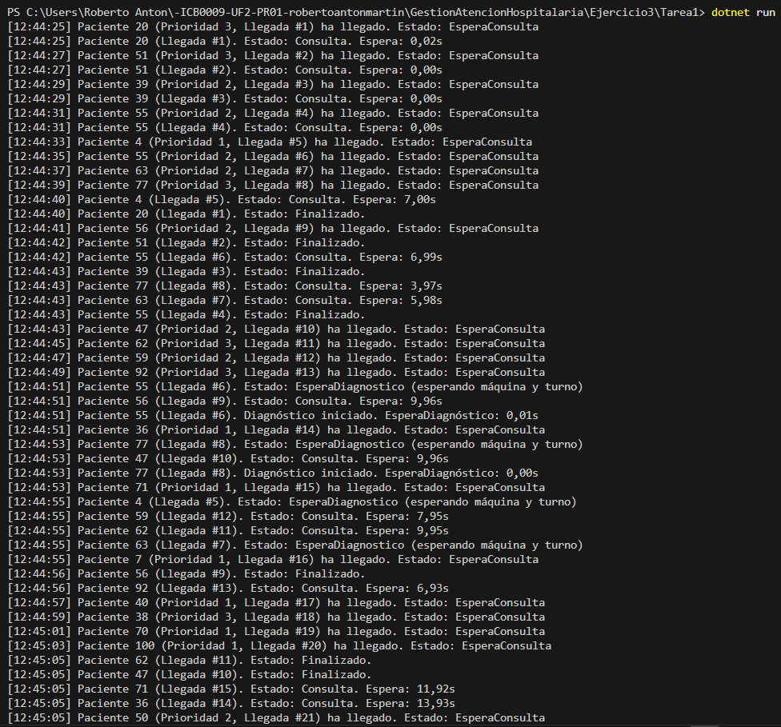
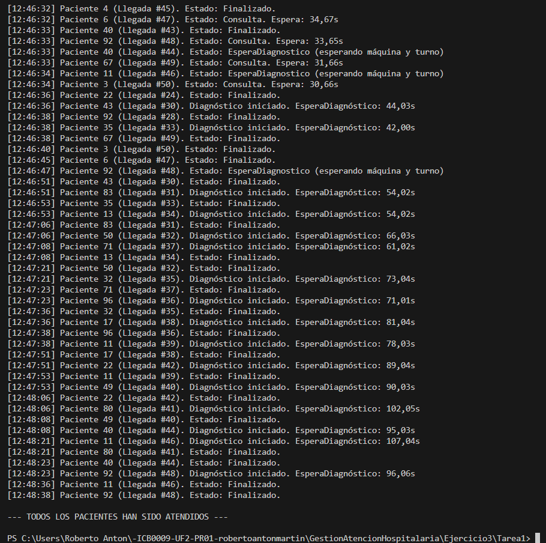
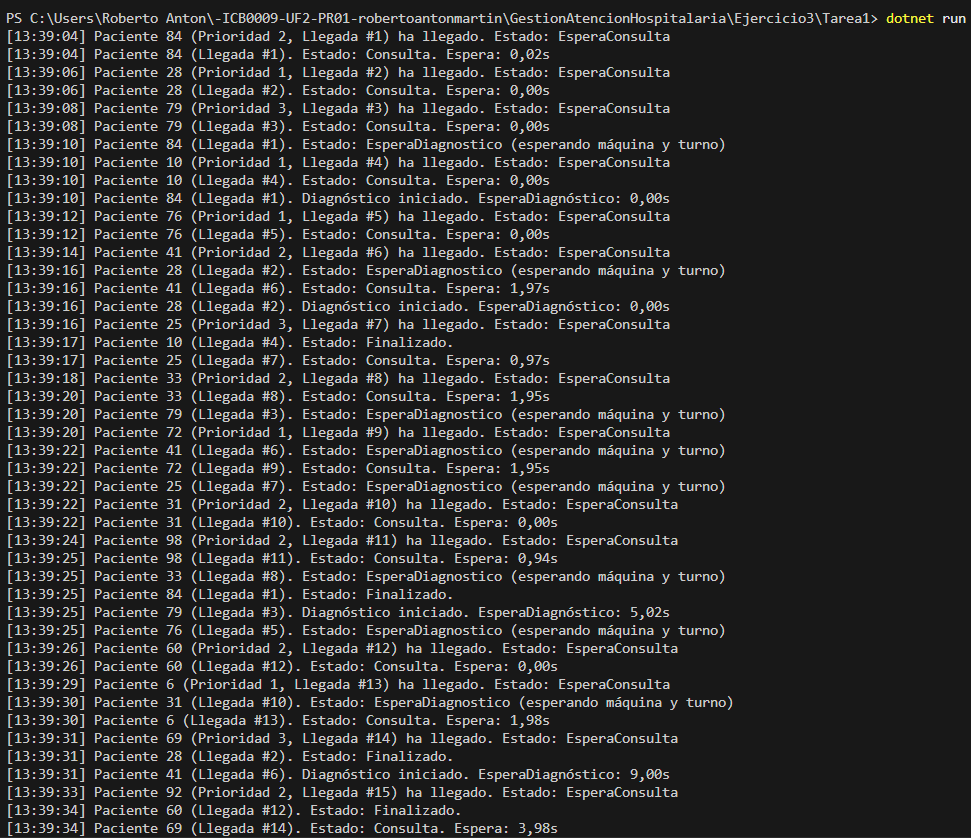
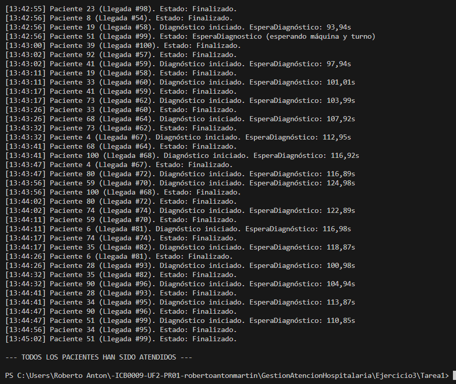
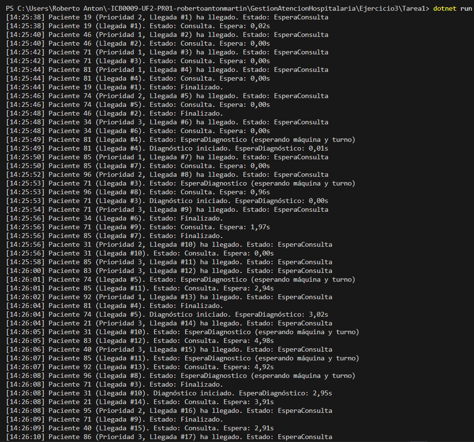
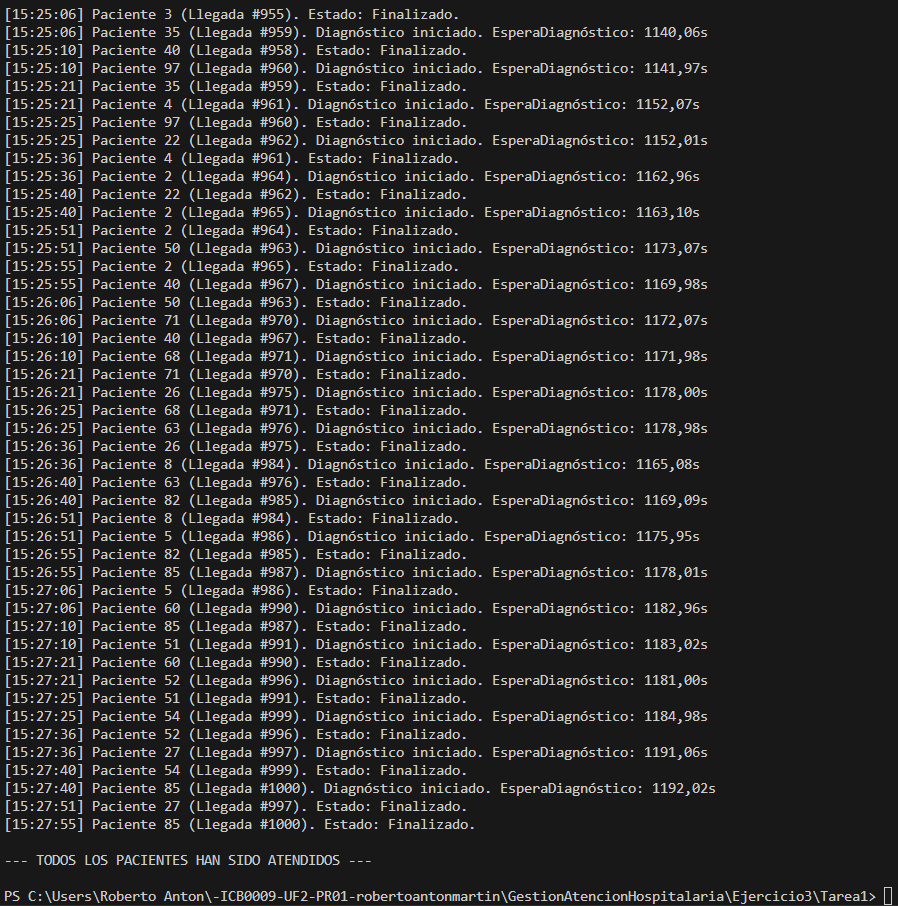

# Ejercicio 3 – Pacientes infinitos – Tarea #1

---

## Parte 1 – Generador de pacientes

En esta tarea he creado un **generador de pacientes** que simula cómo irían llegando personas a un hospital. Cada 2 segundos se genera un nuevo paciente con datos aleatorios:

- Tiempo que va a durar su consulta (entre 5 y 15 segundos).
- Qué tipo de prioridad tiene (1 es emergencia, 2 urgencia, 3 consulta).
- Y si necesita diagnóstico o no.

Esto me permite simular un día de hospital con pacientes llegando poco a poco, sin que estén todos al principio como en tareas anteriores.

---

## Parte 2

### Tarea 1 – ¿Cumple requisitos?

#### Pruebas

He realizado tres pruebas completas con diferentes cantidades de pacientes:

- **50 pacientes**
  - Todo fue bien.
  - El sistema iba rápido, sin cuellos de botella.
  - Las máquinas de diagnóstico funcionaron sin esperas largas.

**Capturas:**

- 
- 

---

- **100 pacientes**
  - Ya empezaban a acumularse pacientes esperando diagnóstico.
  - Aun así, todo seguía funcionando sin errores ni retrasos excesivos.

**Capturas:**

- 
- 

---

- **1000 pacientes**
  - Aquí sí que se notaron largos tiempos de espera en diagnóstico.
  - Aun así, **ningún paciente se quedó bloqueado** y el programa terminó correctamente.

**Capturas:**

- 
- 

---

#### Explicación

He aprovechado todo lo que ya tenía del ejercicio anterior y simplemente he adaptado el generador para que cree pacientes de forma continua.

Cada paciente se gestiona con una `Task`, lo cual es más eficiente que los hilos normales (`Thread`), sobre todo cuando hay muchos.

También mantengo los semáforos para limitar el número de médicos (4) y máquinas de diagnóstico (2), y `lock` para evitar que varios pacientes escriban en la consola a la vez o accedan a listas compartidas.

Con esto, el sistema sigue funcionando correctamente, incluso con 1000 pacientes, respetando tiempos, prioridades y sincronización.

---

### Tarea 2 – ¿Qué comportamientos no previstos detectas?

#### Pruebas

En la prueba con 1000 pacientes he observado cosas que no había visto con menos volumen:

- Algunos pacientes esperaban **más de 1000 segundos** (unos 15-20 minutos) para poder hacer el diagnóstico.
- Las colas eran muy largas, sobre todo si muchos pacientes requerían diagnóstico.
- Al final del programa, **todo funcionaba y nadie se quedaba sin atender**, pero los tiempos eran exagerados.

---

#### Explicación

El problema más evidente ha sido que **solo hay 2 máquinas de diagnóstico**. Con tantos pacientes, se forma un tapón enorme en esa parte.

Aunque los pacientes hacen cola correctamente (por prioridad y orden de llegada), al haber tanta gente, las esperas se disparan.

Otra cosa que podría mejorarse es la espera activa que hace cada paciente para comprobar si le toca (con `Thread.Sleep(200)`), que no es lo más eficiente si hay cientos esperando.

---

### Tarea 3 – ¿Cómo adaptarías tu solución?

#### Explicación

Si tuviera que hacer que esto funcionara con miles de pacientes en un hospital más grande o durante más tiempo, estas serían mis ideas para mejorar:

1. **Poner más máquinas de diagnóstico**, si el hospital lo permite.
2. Cambiar la espera activa por un sistema más eficiente, como usar señales.
3. Usar estructuras de datos pensadas para concurrencia, como `ConcurrentQueue`, o incluso una cola con prioridad real.
4. Añadir un sistema que vaya controlando cuántos pacientes hay activos al mismo tiempo, para que no se saturen los recursos.
5. Y sobre todo, medir bien los tiempos y si hace falta, ajustar la lógica según las estadísticas reales.

---

## Conclusión

Este ejercicio me ha servido para ver cómo se comporta un sistema concurrente cuando empieza a recibir más carga. He podido mantener el orden, la prioridad y la sincronización, pero también me ha hecho pensar en cómo escalar este tipo de aplicaciones si hiciera falta en el futuro.
